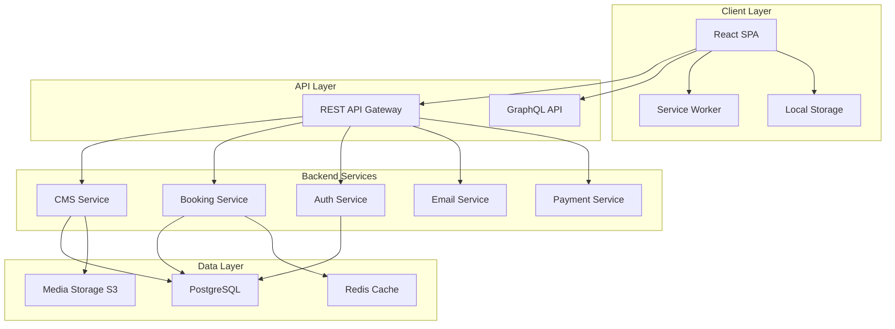

# Design Document

## Overview

This design document outlines the technical architecture and implementation approach for a premium event organizing website. The solution will be built using React 19 with Vite as the build tool, creating a modern, performant single-page application (SPA) with server-side rendering capabilities for SEO optimization.

The website will feature a component-based architecture with reusable UI elements, state management for complex interactions, and integration with backend services for booking, CMS, and client portal functionality. The design emphasizes performance, accessibility, and a luxurious user experience through sophisticated animations and interactions.

### Technology Stack

- **Frontend Framework**: React 19 with Vite
- **Routing**: React Router v6
- **State Management**: React Context API + useReducer for complex state, local state for simple components
- **Styling**: CSS Modules + Tailwind CSS for utility-first styling with custom theme
- **Animations**: Framer Motion for smooth, professional animations
- **3D Visualization**: Three.js with React Three Fiber for venue visualizer
- **Forms**: React Hook Form with Zod validation
- **HTTP Client**: Axios for API communication
- **Image Optimization**: React Lazy Load Image Component + Vite image optimization plugins
- **SEO**: React Helmet Async for meta tags management
- **i18n**: react-i18next for multilingual support
- **Backend/CMS**: Headless CMS (Strapi or Contentful) with REST/GraphQL API
- **Deployment**: Vercel or Netlify for frontend, separate backend hosting

## Architecture

### High-Level Architecture



### Component Architecture

The application follows a hierarchical component structure with clear separation of concerns:

```
src/
├── components/
│   ├── common/           # Reusable UI components
│   │   ├── Button/
│   │   ├── Card/
│   │   ├── Modal/
│   │   ├── Input/
│   │   └── Loader/
│   ├── layout/           # Layout components
│   │   ├── Header/
│   │   ├── Footer/
│   │   ├── Navigation/
│   │   └── PageWrapper/
│   ├── home/             # Homepage specific components
│   │   ├── HeroSection/
│   │   ├── ServicesOverview/
│   │   ├── PortfolioPreview/
│   │   └── Testimonials/
│   ├── services/         # Services page components
│   │   ├── ServiceCategory/
│   │   ├── ServiceCard/
│   │   └── PricingTable/
│   ├── portfolio/        # Portfolio components
│   │   ├── GalleryGrid/
│   │   ├── FilterBar/
│   │   └── PortfolioModal/
│   ├── tools/            # Interactive tools
│   │   ├── EventPlanner/
│   │   └── VenueVisualizer/
│   └── portal/           # Client portal components
│       ├── Dashboard/
│       ├── Timeline/
│       └── Documents/
├── pages/                # Page components
├── hooks/                # Custom React hooks
├── context/              # Context providers
├── services/             # API service layer
├── utils/                # Utility functions
├── constants/            # Constants and config
└── styles/               # Global styles and theme
```

### State Management Strategy

**Global State (Context API):**
- User authentication state
- Language preference (i18n)
- Theme/brand configuration
- Shopping cart/quote builder state
- Client portal data

**Local Component State:**
- Form inputs and validation
- UI toggles (modals, dropdowns)
- Animation states
- Temporary data

**Server State (React Query):**
- Portfolio data
- Blog posts
- Service information
- Booking availability
- Client portal data

## Components and Interfaces

### Core Component Specifications

#### 1. Header Component

**Purpose**: Primary navigation and branding

**Props Interface**:
```typescript
interface HeaderProps {
  transparent?: boolean;
  fixed?: boolean;
  currentLanguage: 'en' | 'sw';
  onLanguageChange: (lang: 'en' | 'sw') => void;
}
```

**Features**:
- Sticky navigation with scroll-based transparency change
- Mobile hamburger menu with smooth slide-in animation
- Language switcher dropdown
- CTA button (Get a Quote)
- Logo with link to homepage
- Active route highlighting

#### 2. Hero Section Component

**Purpose**: Main landing section with video/slider background

**Props Interface**:
```typescript
interface HeroSectionProps {
  slides: Array<{
    id: string;
    type: 'image' | 'video';
    src: string;
    alt?: string;
  }>;
  autoPlayInterval?: number;
}
```

**Features**:
- Full-width responsive background
- Auto-playing slider with manual controls
- Parallax scrolling effect
- Animated text entrance
- Dual CTA buttons with hover effects
- Overlay gradient for text readability

#### 3. Service Category Component

**Purpose**: Expandable service category with details

**Props Interface**:
```typescript
interface ServiceCategoryProps {
  category: {
    id: string;
    name: string;
    icon: string;
    services: Array<{
      id: string;
      name: string;
      description: string;
      features: string[];
      pricing?: string;
    }>;
  };
  defaultExpanded?: boolean;
}
```

**Features**:
- Accordion-style expansion
- Icon animations on hover
- Service cards with flip animation for details
- Smooth height transitions
- Mobile-optimized layout

#### 4. Portfolio Gallery Component

**Purpose**: Filterable image/video gallery

**Props Interface**:
```typescript
interface PortfolioGalleryProps {
  items: Array<{
    id: string;
    type: 'image' | 'video';
    src: string;
    thumbnail: string;
    category: string[];
    title: string;
    description: string;
    testimonial?: string;
  }>;
  categories: string[];
}
```

**Features**:
- Masonry grid layout
- Filter by category with smooth transitions
- Lightbox modal for full-size viewing
- Lazy loading for performance
- Before/after slider for transformation projects
- Share functionality

#### 5. Event Planner Tool Component

**Purpose**: Interactive quiz/checklist for event planning

**Props Interface**:
```typescript
interface EventPlannerProps {
  onComplete: (results: EventPlanResults) => void;
}

interface EventPlanResults {
  eventType: string;
  style: string;
  guestCount: number;
  budget: string;
  recommendedServices: string[];
  estimatedCost: { min: number; max: number };
}
```

**Features**:
- Multi-step wizard interface
- Progress indicator
- Conditional questions based on previous answers
- Visual style selector with images
- Results page with recommendations
- Save/email functionality
- Direct quote request integration

#### 6. 3D Venue Visualizer Component

**Purpose**: Interactive 3D event layout visualization

**Props Interface**:
```typescript
interface VenueVisualizerProps {
  availableElements: Array<{
    id: string;
    type: 'tent' | 'table' | 'chair' | 'stage' | 'decor';
    model: string;
    dimensions: { width: number; length: number; height: number };
  }>;
  onSave: (layout: VenueLayout) => void;
}
```

**Features**:
- 3D canvas with orbit controls
- Drag-and-drop element placement
- Snap-to-grid functionality
- Multiple view angles (top, side, perspective)
- Measurement tools
- Export as image or 3D file
- Integration with quote system

#### 7. Booking System Component

**Purpose**: Date availability checker and booking interface

**Props Interface**:
```typescript
interface BookingSystemProps {
  onBookingRequest: (booking: BookingRequest) => void;
}

interface BookingRequest {
  eventDate: Date;
  eventType: string;
  services: string[];
  guestCount: number;
  venue?: string;
  additionalNotes: string;
}
```

**Features**:
- Calendar with availability indicators
- Real-time availability checking
- Service selection with dependencies
- Guest count calculator
- Budget estimator
- Alternative date suggestions
- Form validation with helpful errors

#### 8. Client Portal Dashboard Component

**Purpose**: Authenticated client dashboard

**Props Interface**:
```typescript
interface ClientDashboardProps {
  clientId: string;
  eventData: ClientEvent;
}

interface ClientEvent {
  id: string;
  name: string;
  date: Date;
  status: 'planning' | 'confirmed' | 'in-progress' | 'completed';
  timeline: TimelineItem[];
  documents: Document[];
  payments: Payment[];
  messages: Message[];
}
```

**Features**:
- Event timeline visualization
- Document viewer and e-signature
- Payment tracking and processing
- Direct messaging with coordinator
- Progress indicators
- Notification center
- Mobile-responsive design

### API Service Layer

**Service Structure**:
```typescript
// services/api.js
class APIService {
  constructor(baseURL) {
    this.client = axios.create({
      baseURL,
      timeout: 10000,
      headers: { 'Content-Type': 'application/json' }
    });
  }
  
  // Interceptors for auth, error handling
  setupInterceptors() { }
}

// services/portfolioService.js
export const portfolioService = {
  getAll: (filters) => {},
  getById: (id) => {},
  getByCategory: (category) => {}
};

// services/bookingService.js
export const bookingService = {
  checkAvailability: (date, services) => {},
  createBooking: (bookingData) => {},
  getBookingById: (id) => {}
};

// services/cmsService.js
export const cmsService = {
  getPageContent: (page) => {},
  getBlogPosts: (filters) => {},
  getTestimonials: () => {}
};
```

## Data Models

### Portfolio Item Model

```typescript
interface PortfolioItem {
  id: string;
  title: string;
  description: string;
  eventType: 'wedding' | 'corporate' | 'birthday' | 'other';
  date: Date;
  media: Array<{
    type: 'image' | 'video';
    url: string;
    thumbnail: string;
    alt: string;
  }>;
  services: string[];
  testimonial?: {
    clientName: string;
    quote: string;
    rating: number;
  };
  beforeAfter?: {
    before: string;
    after: string;
  };
  featured: boolean;
  tags: string[];
}
```

### Service Model

```typescript
interface Service {
  id: string;
  name: string;
  category: 'core' | 'decor' | 'media' | 'logistics';
  description: string;
  features: string[];
  pricing: {
    type: 'fixed' | 'range' | 'custom';
    amount?: number;
    min?: number;
    max?: number;
    unit?: string;
  };
  icon: string;
  images: string[];
  dependencies?: string[]; // Other service IDs required
  addOns?: string[]; // Optional related services
}
```

### Booking Model

```typescript
interface Booking {
  id: string;
  clientId: string;
  eventDate: Date;
  eventType: string;
  status: 'inquiry' | 'quoted' | 'confirmed' | 'completed' | 'cancelled';
  services: Array<{
    serviceId: string;
    quantity: number;
    customizations?: Record<string, any>;
  }>;
  venue?: {
    name: string;
    address: string;
    capacity: number;
  };
  guestCount: number;
  budget: {
    estimated: number;
    quoted?: number;
    final?: number;
  };
  timeline: Array<{
    date: Date;
    milestone: string;
    status: 'pending' | 'completed';
  }>;
  documents: Array<{
    type: 'contract' | 'invoice' | 'receipt';
    url: string;
    signed: boolean;
  }>;
  payments: Array<{
    amount: number;
    date: Date;
    method: string;
    status: 'pending' | 'completed' | 'failed';
  }>;
  notes: string;
  createdAt: Date;
  updatedAt: Date;
}
```

### User/Client Model

```typescript
interface Client {
  id: string;
  email: string;
  name: string;
  phone: string;
  company?: string;
  preferredLanguage: 'en' | 'sw';
  bookings: string[]; // Booking IDs
  savedLayouts?: string[]; // Venue visualizer layouts
  preferences: {
    eventTypes: string[];
    budgetRange: string;
    communicationMethod: 'email' | 'phone' | 'whatsapp';
  };
  createdAt: Date;
}
```

### Blog Post Model

```typescript
interface BlogPost {
  id: string;
  title: string;
  slug: string;
  excerpt: string;
  content: string; // Rich text/Markdown
  author: {
    name: string;
    avatar: string;
  };
  featuredImage: string;
  category: string;
  tags: string[];
  publishedAt: Date;
  updatedAt: Date;
  seo: {
    metaTitle: string;
    metaDescription: string;
    keywords: string[];
  };
}
```

## Error Handling

### Error Handling Strategy

**Client-Side Error Boundaries**:
```typescript
class ErrorBoundary extends React.Component {
  state = { hasError: false, error: null };
  
  static getDerivedStateFromError(error) {
    return { hasError: true, error };
  }
  
  componentDidCatch(error, errorInfo) {
    // Log to error tracking service (Sentry)
    logErrorToService(error, errorInfo);
  }
  
  render() {
    if (this.state.hasError) {
      return <ErrorFallback error={this.state.error} />;
    }
    return this.props.children;
  }
}
```

**API Error Handling**:
```typescript
const handleAPIError = (error) => {
  if (error.response) {
    // Server responded with error status
    switch (error.response.status) {
      case 400:
        return { type: 'validation', message: error.response.data.message };
      case 401:
        return { type: 'auth', message: 'Please log in to continue' };
      case 404:
        return { type: 'notFound', message: 'Resource not found' };
      case 500:
        return { type: 'server', message: 'Server error. Please try again.' };
      default:
        return { type: 'unknown', message: 'An error occurred' };
    }
  } else if (error.request) {
    // Request made but no response
    return { type: 'network', message: 'Network error. Check your connection.' };
  } else {
    // Something else happened
    return { type: 'client', message: error.message };
  }
};
```

**Form Validation Errors**:
- Real-time validation with debouncing
- Clear, actionable error messages
- Field-level and form-level errors
- Accessibility-compliant error announcements

**Graceful Degradation**:
- Fallback UI for failed image loads
- Skeleton loaders during data fetching
- Offline mode with cached content
- Progressive enhancement for advanced features

## Testing Strategy

### Testing Pyramid

**Unit Tests (70%)**:
- Component logic testing with React Testing Library
- Utility function testing with Jest
- Custom hooks testing
- Form validation logic
- State management reducers

**Integration Tests (20%)**:
- Component integration testing
- API service integration
- Form submission flows
- Navigation and routing
- Authentication flows

**End-to-End Tests (10%)**:
- Critical user journeys with Playwright
- Booking flow from start to finish
- Quote request process
- Client portal login and navigation
- Cross-browser compatibility

### Testing Tools

- **Unit/Integration**: Jest + React Testing Library
- **E2E**: Playwright
- **Visual Regression**: Percy or Chromatic
- **Accessibility**: axe-core + jest-axe
- **Performance**: Lighthouse CI

### Test Coverage Goals

- Minimum 80% code coverage
- 100% coverage for critical paths (booking, payments)
- All user-facing forms tested
- All API integrations mocked and tested

## Performance Optimization

### Image Optimization

- WebP format with JPEG/PNG fallbacks
- Responsive images with srcset
- Lazy loading below the fold
- Blur-up placeholder technique
- CDN delivery (Cloudinary or Imgix)
- Maximum image size limits

### Code Splitting

```typescript
// Route-based code splitting
const HomePage = lazy(() => import('./pages/HomePage'));
const ServicesPage = lazy(() => import('./pages/ServicesPage'));
const PortfolioPage = lazy(() => import('./pages/PortfolioPage'));

// Component-based splitting for heavy components
const VenueVisualizer = lazy(() => import('./components/tools/VenueVisualizer'));
```

### Caching Strategy

- Service Worker for offline support
- API response caching with React Query
- LocalStorage for user preferences
- CDN caching for static assets
- Browser caching headers

### Performance Metrics Targets

- First Contentful Paint (FCP): < 1.5s
- Largest Contentful Paint (LCP): < 2.5s
- Time to Interactive (TTI): < 3.5s
- Cumulative Layout Shift (CLS): < 0.1
- First Input Delay (FID): < 100ms

## Accessibility

### WCAG 2.1 AA Compliance

- Semantic HTML structure
- ARIA labels and roles where needed
- Keyboard navigation support
- Focus management and visible focus indicators
- Color contrast ratios meeting standards
- Screen reader testing
- Alternative text for all images
- Captions for videos
- Form labels and error associations

### Accessibility Features

- Skip to main content link
- Keyboard shortcuts documentation
- Reduced motion support
- High contrast mode
- Font size adjustments
- Screen reader announcements for dynamic content

## SEO Strategy

### Technical SEO

- Server-side rendering or static generation for critical pages
- Dynamic meta tags with React Helmet
- Structured data (JSON-LD) for events, services, reviews
- XML sitemap generation
- Robots.txt configuration
- Canonical URLs
- Open Graph tags for social sharing
- Twitter Card tags

### Content SEO

- Keyword-optimized page titles and descriptions
- Header hierarchy (H1, H2, H3)
- Internal linking strategy
- Blog content for long-tail keywords
- Image alt text optimization
- Fast page load times
- Mobile-first indexing optimization

## Security Considerations

### Frontend Security

- XSS prevention through React's built-in escaping
- CSRF tokens for form submissions
- Content Security Policy headers
- Secure cookie handling
- Input sanitization
- Rate limiting on API calls
- Secure authentication token storage

### Data Protection

- HTTPS everywhere
- GDPR compliance (cookie consent, data deletion)
- Privacy policy and terms of service
- Secure payment processing (PCI DSS compliance)
- Data encryption at rest and in transit
- Regular security audits

## Deployment and DevOps

### CI/CD Pipeline

```yaml
# Example GitHub Actions workflow
name: Deploy
on:
  push:
    branches: [main]
jobs:
  test:
    runs-on: ubuntu-latest
    steps:
      - uses: actions/checkout@v2
      - run: npm ci
      - run: npm test
      - run: npm run lint
  build:
    needs: test
    runs-on: ubuntu-latest
    steps:
      - uses: actions/checkout@v2
      - run: npm ci
      - run: npm run build
      - uses: actions/upload-artifact@v2
  deploy:
    needs: build
    runs-on: ubuntu-latest
    steps:
      - uses: actions/download-artifact@v2
      - name: Deploy to Vercel
        run: vercel --prod
```

### Environment Configuration

- Development, staging, and production environments
- Environment variables for API keys and secrets
- Feature flags for gradual rollouts
- Monitoring and logging (Sentry, LogRocket)
- Analytics integration (Google Analytics, Hotjar)

### Monitoring

- Error tracking and alerting
- Performance monitoring
- Uptime monitoring
- User behavior analytics
- Conversion funnel tracking
- A/B testing infrastructure

## Design System and Theming

### Color System

```css
:root {
  /* Primary Colors */
  --color-gold: #D4AF37;
  --color-gold-light: #E8D4A0;
  --color-gold-dark: #B8941F;
  
  /* Secondary Colors */
  --color-navy: #001F3F;
  --color-navy-light: #1A3A5C;
  --color-navy-dark: #000D1A;
  
  /* Accent Colors */
  --color-burgundy: #800020;
  --color-burgundy-light: #A6334F;
  --color-burgundy-dark: #5A0016;
  
  /* Neutral Colors */
  --color-cream: #FFFDD0;
  --color-cream-dark: #F5F3C8;
  --color-white: #FFFFFF;
  --color-gray-100: #F7F7F7;
  --color-gray-300: #D1D1D1;
  --color-gray-500: #9E9E9E;
  --color-gray-700: #616161;
  --color-gray-900: #212121;
  
  /* Semantic Colors */
  --color-success: #4CAF50;
  --color-warning: #FF9800;
  --color-error: #F44336;
  --color-info: #2196F3;
}
```

### Typography Scale

```css
:root {
  /* Font Families */
  --font-heading: 'Playfair Display', serif;
  --font-body: 'Montserrat', sans-serif;
  
  /* Font Sizes */
  --text-xs: 0.75rem;    /* 12px */
  --text-sm: 0.875rem;   /* 14px */
  --text-base: 1rem;     /* 16px */
  --text-lg: 1.125rem;   /* 18px */
  --text-xl: 1.25rem;    /* 20px */
  --text-2xl: 1.5rem;    /* 24px */
  --text-3xl: 1.875rem;  /* 30px */
  --text-4xl: 2.25rem;   /* 36px */
  --text-5xl: 3rem;      /* 48px */
  --text-6xl: 3.75rem;   /* 60px */
  
  /* Line Heights */
  --leading-tight: 1.25;
  --leading-normal: 1.5;
  --leading-relaxed: 1.75;
  
  /* Font Weights */
  --font-light: 300;
  --font-normal: 400;
  --font-medium: 500;
  --font-semibold: 600;
  --font-bold: 700;
}
```

### Spacing System

```css
:root {
  --space-1: 0.25rem;   /* 4px */
  --space-2: 0.5rem;    /* 8px */
  --space-3: 0.75rem;   /* 12px */
  --space-4: 1rem;      /* 16px */
  --space-5: 1.25rem;   /* 20px */
  --space-6: 1.5rem;    /* 24px */
  --space-8: 2rem;      /* 32px */
  --space-10: 2.5rem;   /* 40px */
  --space-12: 3rem;     /* 48px */
  --space-16: 4rem;     /* 64px */
  --space-20: 5rem;     /* 80px */
  --space-24: 6rem;     /* 96px */
}
```

### Animation System

```css
:root {
  /* Durations */
  --duration-fast: 150ms;
  --duration-normal: 300ms;
  --duration-slow: 500ms;
  
  /* Easings */
  --ease-in: cubic-bezier(0.4, 0, 1, 1);
  --ease-out: cubic-bezier(0, 0, 0.2, 1);
  --ease-in-out: cubic-bezier(0.4, 0, 0.2, 1);
  --ease-bounce: cubic-bezier(0.68, -0.55, 0.265, 1.55);
}
```

## Internationalization (i18n)

### Translation Structure

```typescript
// locales/en/common.json
{
  "nav": {
    "home": "Home",
    "services": "Services",
    "portfolio": "Portfolio",
    "about": "About Us",
    "blog": "Blog",
    "contact": "Contact"
  },
  "hero": {
    "headline": "Your Dream Event, Perfected by {{businessName}}",
    "subheading": "From tents and catering to décor and logistics, we bring your vision to life",
    "cta": {
      "quote": "Get a Free Quote",
      "explore": "Explore Our Services"
    }
  }
}

// locales/sw/common.json
{
  "nav": {
    "home": "Nyumbani",
    "services": "Huduma",
    "portfolio": "Kazi Zetu",
    "about": "Kuhusu Sisi",
    "blog": "Blogu",
    "contact": "Wasiliana"
  },
  "hero": {
    "headline": "Tukio Lako la Ndoto, Limekamilishwa na {{businessName}}",
    "subheading": "Kutoka mahema na chakula hadi mapambo na usimamizi, tunaleta maono yako kuwa ukweli",
    "cta": {
      "quote": "Pata Nukuu Bila Malipo",
      "explore": "Gundua Huduma Zetu"
    }
  }
}
```

### Language Detection and Switching

- Browser language detection on first visit
- Persistent language preference in localStorage
- Language switcher in header
- URL-based language routing (/en/, /sw/)
- Automatic RTL support if needed in future

## Third-Party Integrations

### Essential Integrations

1. **Google Maps API**: Location display and venue mapping
2. **WhatsApp Business API**: Live chat integration
3. **Stripe/PayPal**: Payment processing
4. **SendGrid/Mailgun**: Transactional emails
5. **Cloudinary**: Image hosting and optimization
6. **Google Analytics**: Website analytics
7. **Facebook Pixel**: Ad tracking and retargeting
8. **Calendly**: Meeting scheduling (optional)
9. **Trustpilot/Google Reviews**: Review aggregation

### CMS Integration

**Headless CMS Choice: Strapi (Self-hosted) or Contentful (SaaS)**

Benefits:
- Easy content management for non-technical users
- RESTful and GraphQL APIs
- Media library management
- Role-based access control
- Content versioning
- Webhook support for real-time updates

## Mobile-First Responsive Breakpoints

```css
/* Mobile First Approach */
/* Base styles: Mobile (320px - 639px) */

/* Small tablets */
@media (min-width: 640px) { /* sm */ }

/* Tablets */
@media (min-width: 768px) { /* md */ }

/* Small laptops */
@media (min-width: 1024px) { /* lg */ }

/* Desktops */
@media (min-width: 1280px) { /* xl */ }

/* Large desktops */
@media (min-width: 1536px) { /* 2xl */ }
```

## Progressive Web App (PWA) Features

- Service Worker for offline functionality
- Web App Manifest for installability
- Push notifications for booking updates
- Add to home screen prompt
- Offline fallback pages
- Background sync for form submissions

## Conclusion

This design provides a comprehensive blueprint for building a premium, high-performance event organizing website. The architecture emphasizes modularity, scalability, and maintainability while delivering an exceptional user experience. The component-based approach allows for iterative development and easy updates, while the robust testing strategy ensures reliability and quality.

The design balances luxury aesthetics with technical excellence, creating a platform that not only looks stunning but performs flawlessly across all devices and network conditions. By following this design, the implementation will result in a website that effectively showcases services, builds trust with potential clients, and drives conversions through intuitive user flows and compelling calls-to-action.
